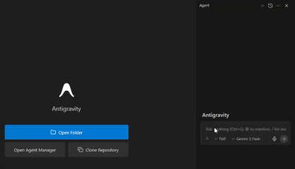
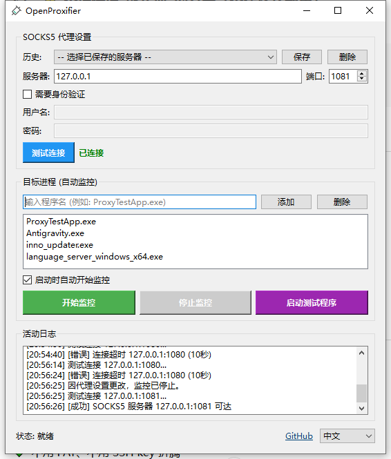

# OpenProxifier

[English](README_EN.md) | [中文](README.md)

A Windows transparent SOCKS5 proxy tool that routes network connections of target applications through a SOCKS5 proxy without modifying the target program or system proxy settings.

## Demo



## Features

- **Two Proxy Modes**:
  - **WinDivert Mode**: Kernel-level packet interception for true transparent proxy (recommended)
  - **DLL Injection Mode**: Hook Winsock APIs via DLL injection for legacy compatibility
- **Rule-Based Routing**: Configure per-application rules (PROXY / DIRECT / BLOCK)
- **Process Monitoring**: Automatically detect and proxy target processes when they start
- **SOCKS5 Authentication**: Full support for username/password authentication (RFC 1929)
- **Connection Testing**: Test proxy server connectivity and authentication before starting
- **Server History**: Save and manage multiple proxy server configurations
- **System Tray**: Minimize to system tray with quick access menu
- **Built-in Test Tool**: ProxyTestApp for verifying proxy functionality
- **Bilingual Interface**: Full English and Chinese UI support

## How It Works

### WinDivert Mode (Recommended)

```
OpenProxifier (Qt GUI)
        |
        | WinDivert kernel driver
        v
Network Packets <---> PacketProcessor
        |
        | NAT redirect to LocalProxy
        v
LocalProxy (TCP:34010)
        |
        | SOCKS5 tunnel
        v
SOCKS5 Proxy Server
        |
        v
    Internet
```

WinDivert mode intercepts network packets at the kernel level using the WinDivert driver. Packets from monitored applications are redirected to a local proxy which tunnels them through the SOCKS5 proxy. This provides true transparent proxying without modifying target applications.

### DLL Injection Mode

```
OpenProxifier (Qt GUI)
        |
        | Monitor & Inject
        v
TargetApp.exe
        |
        | Hook Winsock APIs
        v
OpenProxifierHook.dll
        |
        | Redirect connections
        v
SOCKS5 Proxy Server
```

DLL injection mode uses Microsoft Detours to hook Winsock API calls (`connect`, `WSAConnect`) and redirect TCP connections through the SOCKS5 proxy.

## Requirements

- Windows 10/11 (64-bit)
- Administrator privileges (required for WinDivert)
- Qt 6.x (for building)
- CMake 3.20+
- vcpkg (for Microsoft Detours)

## Building

1. **Install dependencies via vcpkg**:
   ```batch
   vcpkg install detours:x64-windows
   ```

2. **Configure and build**:
   ```batch
   cmake -B build -A x64 -DCMAKE_PREFIX_PATH=C:/Qt/6.x/msvc2022_64 -DCMAKE_TOOLCHAIN_FILE=C:/vcpkg/scripts/buildsystems/vcpkg.cmake
   cmake --build build --config Release
   ```

3. **Output files** are in `build/bin/Release/`:
   - `OpenProxifier_x64.exe` - Main GUI application
   - `OpenProxifierHook_x64.dll` - Hook DLL for injection mode
   - `ProxyTestApp.exe` - Proxy testing tool
   - `WinDivert64.sys` / `WinDivert.dll` - WinDivert driver and library

## Usage

### GUI Mode

1. Launch `OpenProxifier_x64.exe` **as Administrator**
2. Configure SOCKS5 proxy settings (server, port, optional authentication)
3. Click "Test Connection" to verify proxy connectivity
4. Add target process names to the rule list with desired action:
   - **PROXY**: Route through SOCKS5 proxy
   - **DIRECT**: Allow direct connection (bypass proxy)
   - **BLOCK**: Block all connections
5. Click "Start Monitoring" to begin transparent proxying
6. Use "Launch Test App" to verify proxy is working

### Usage Example: Configure Proxy for Antigravity



To route Antigravity (an AI programming tool) through the proxy, add the following three processes to the target list:

| Process Name | Description |
|--------------|-------------|
| `Antigravity.exe` | Main application |
| `inno_updater.exe` | Update program |
| `language_server_windows_x64.exe` | Language server |

Configuration steps:
1. Set SOCKS5 proxy server address and port (e.g., `127.0.0.1:1081`)
2. Click "Test Connection" to verify proxy availability
3. Add the three processes above to the "Target Processes" list
4. Check "Auto-start monitoring on launch" (optional)
5. Click "Start Monitoring"

All network requests from Antigravity will now go through the SOCKS5 proxy.

### Command Line Mode

```batch
# Set proxy via environment variable
set PROXIFIER_PROXY=127.0.0.1:1080

# Inject into a specific program
ProxifierInjector_x64.exe notepad.exe

# With authentication
set PROXIFIER_PROXY=127.0.0.1:1080
set PROXIFIER_USER=username
set PROXIFIER_PASS=password
ProxifierInjector_x64.exe curl.exe http://httpbin.org/ip
```

## Project Structure

```
OpenProxifier/
├── launcher/           # Qt GUI application
│   ├── MainWindow.*    # Main window UI and logic
│   ├── ProcessMonitor.*# Process detection and injection
│   ├── Injector.*      # DLL injection implementation
│   └── ProxyEngineWrapper.*  # C++/C bridge for core engine
├── core/               # WinDivert transparent proxy engine (C)
│   ├── ProxyEngine.*   # Main engine interface
│   ├── PacketProcessor.* # Packet interception and NAT
│   ├── LocalProxy.*    # Local SOCKS5 tunnel proxy
│   ├── RuleEngine.*    # Per-application routing rules
│   ├── ConnectionTracker.* # NAT connection tracking
│   ├── Socks5.*        # SOCKS5 protocol implementation
│   └── UdpRelay.*      # UDP relay support
├── hookdll/            # Injected DLL for injection mode
│   ├── HookManager.*   # Hook installation/removal
│   ├── WinsockHooks.*  # Winsock API hooks
│   └── Socks5Client.*  # SOCKS5 protocol implementation
├── proxytestapp/       # Proxy test application
├── common/             # Shared headers
│   ├── ProxyConfig.h   # Proxy configuration structure
│   └── SharedMemory.h  # IPC via shared memory
└── cli/                # Command line tools
```

## Technical Details

### WinDivert Mode

- Uses WinDivert 2.2 for kernel-level packet capture
- Implements bidirectional NAT for transparent redirection
- LocalProxy listens on TCP port 34010
- Supports per-process rule matching via PID tracking

### Hooked APIs (Injection Mode)

| DLL | Function | Purpose |
|-----|----------|---------|
| ws2_32.dll | connect | Redirect TCP connections |
| ws2_32.dll | WSAConnect | Redirect TCP connections (extended) |
| kernel32.dll | CreateProcessW | Inject into child processes |
| kernel32.dll | CreateProcessA | Inject into child processes |

### SOCKS5 Protocol Support

- SOCKS5 version 5 (RFC 1928)
- No authentication (0x00)
- Username/password authentication (0x02, RFC 1929)
- CONNECT command for TCP connections
- IPv4 and IPv6 address support

## Known Limitations

- WinDivert mode requires Administrator privileges
- Some applications with anti-debugging features may not work with injection mode
- UDP proxying is experimental

## License

Apache-2.0 (commercial friendly)

## Contributing

Contributions are welcome! Please feel free to submit issues and pull requests.

## Acknowledgments

- [WinDivert](https://github.com/basil00/WinDivert) - Windows packet capture/modification library
- [Microsoft Detours](https://github.com/microsoft/Detours) - API hooking library
- [Qt Framework](https://www.qt.io/) - GUI framework
